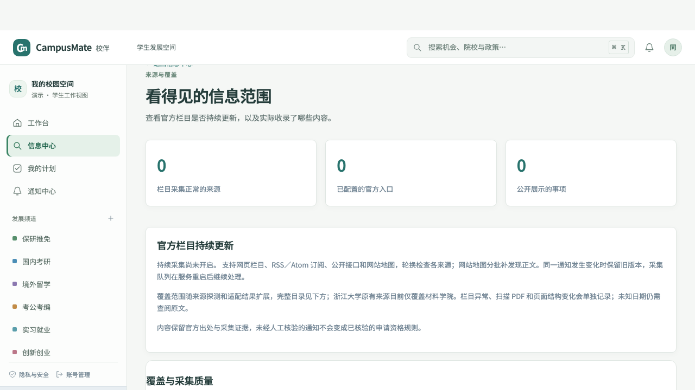
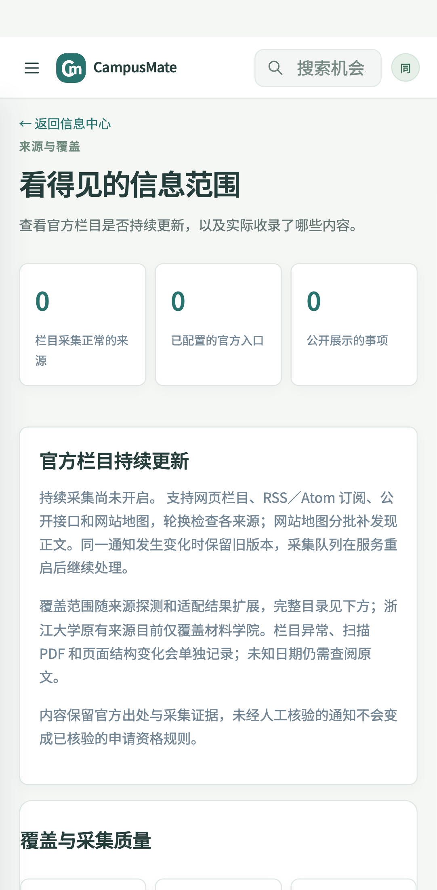

# 数据采集开发进度（2026-10-04）

> 2026-10-07 已继续扩充来源目录并验证新增链路，最新范围与剩余缺口见 [第九轮来源扩充](SOURCE_EXPANSION_ROUND9.md)。本文保留原整合与迁移说明。

本分支以队友仓库 main 的 `2d3956f` 为基线，整合本地采集与信息覆盖功能。登录／邮箱 OTP、创业工作台、设置页和 Agent 增强继续沿用队友版本。源码位于仓库根目录，未再套一层 CampusMate 目录。

## 本次提交范围

- 多主题官方来源目录，RSS／Atom、公开 JSON、网站地图与栏目轮换发现。
- 持久队列、失败诊断、最后成功时间、质量统计、同文归并及来源筛选。
- PDF、DOC／DOCX、XLS／XLSX 和正文图片解析、OCR、父公告附件归档与证据定位。
- 公开原文交换、接收后重新解析、撤回保护、独立监控和告警去重／重试。
- 覆盖率页面、运维脚本、采集专用 Docker 部署、备份工具、API 契约与回归测试。

原始本地数据库、环境文件、私钥、账号／个人计划／会话、运行日志、依赖和发布压缩包未提交。沿用仓库已有的公开演示快照，不声称该快照含本机最新采集数据。候选来源目录的探测结果是历史抽样，不代表队友电脑已开启持续采集。

## 数据库迁移

队友创业工作台的 `0028_startup_workspace.py` 保留。本地采集的三个迁移改用仓库编号：

| 迁移 | 内容 | 前置迁移 |
| --- | --- | --- |
| 0031 | 采集成功时间、失败归档、监控告警 | 0028 |
| 0032 | 原文交换状态与重试记录 | 0031 |
| 0033 | 持久告警通知队列 | 0032 |

在队友仓库已有数据库上正常执行 `alembic upgrade head`。本次检查覆盖新库迁移及从队友 `0028` 升级，`alembic check` 无新增操作。

原开发目录和既有云部署使用另一套迁移历史，仍保留原样；不要直接把其标记为 0028–0030 的数据库接到本分支。本机／云部署历史记录见 [持续信息源扩充](SOURCE_EXPANSION.md) 和 [采集运维历史](COLLECTION_OPERATIONS_HISTORY.md)，不代表本次重新部署验收。

## 接手运行

按 README 安装依赖并构建后，使用仓库入口：

```bash
backend/.venv/bin/python scripts/start_local.py --collector-off
```

不带 `--collector-off` 时可开启公开栏目采集；启动器按目录中可用来源生成主机白名单。已有来源暂停与许可 Blocker 仍受保留；未配置白名单不会自动放宽访问。

macOS 本机解析附件需要 `antiword`／`catdoc`、Poppler 和带 `chi_sim`／`eng` 语言包的 Tesseract；Docker 与后端 CI 安装对应依赖。没有外部解析工具时保留失败状态，不生成伪造文本或日期。

独立配置可先运行 `backend/.venv/bin/python scripts/prepare_watch_env.py` 查看非敏感采集环境选项，再在后端登记与安装：

```bash
cd backend
.venv/bin/python -m alembic upgrade head
.venv/bin/python -m app.source_registry
.venv/bin/python ../scripts/refresh_postgraduate.py --install --actor local-operator
.venv/bin/python -m app.worker
```

原文交换、Webhook、云端巡检及备份需要运营者自行配置环境变量，提交源码不会自动创建远程服务或发送通知。异地镜像脚本需设置 `RAILWAY_BACKUP_PROJECT_ID` 和 `RAILWAY_BACKUP_SERVICE_ID`，未保留本机项目编号。

## 本次整合验证

- `PYTHONPATH="$PWD/backend" bash scripts/check.sh`：301 项后端测试、2 项监督器测试、22 项前端测试、TypeScript 和 Next.js 生产构建通过。
- 新库及队友 0028 迁移到 0033，`alembic check` 无结构差异。
- 信息中心／导入／来源校准／来源目录浏览器回归：桌面与手机共 8 项通过，含空态、目录筛选和横向溢出检查。
- 已尝试全量浏览器脚本；旧 Agent／工作空间用例依赖另一套种子数据、学生站点和功能开关，本次未完成全量验收。CI 的浏览器任务运行本次数据范围的用例。
- 文件检查未发现私钥或常见凭据格式；仅上传源码、文档与明确的测试夹具。

浏览器可用 `E2E_API_PORT=8101 E2E_WEB_PORT=3101` 指定空闲端口，避免打断本机已有演示服务。

## 界面截图

以下为隔离测试库，未安装监测，顶部实际运行计数为 0；来源目录仍可筛选历史抽样结果。




